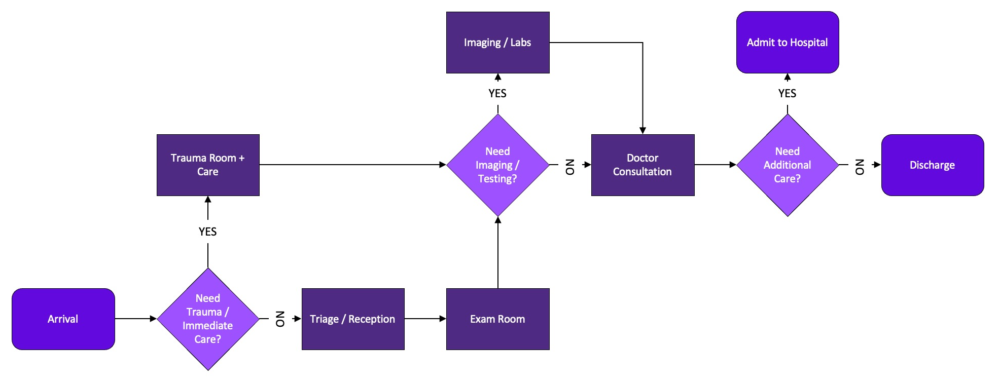

# Emergency Room Process Simulation

## Critical Thinking Group 1

### Contributors:

- Jaimon Abraham
- Stefan Jenss
- Maryam Mullenix
- Forrest Strodel

**Northwestern University**  
**Decision Analytics (MSDS460)**  
**Professor Thomas Miller**  
**December 3rd, 2023**  

## Project Overview

This GitHub repository contains the discrete event simulation project developed by Critical Thinking Group 1 (CTG1) for simulating an emergency room (ER) process from patient arrival through discharge or hospital admission. The simulation aims to represent the complexity and dynamic nature of the ER environment and models various patient paths through the ER. The simulation integrates multiple aspects of ER operations, including trauma patients requiring immediate care and the added process of patients who need imaging and laboratory testing.

For future projects, this simulation could be built upon by adding levels of patient priority, shifting of staff behavior and fatigue, the natural ebb-and-flow of patient arrival throughout different times of the day, or the incorporation of sporadic and unexpected mass casualty incidents (MSIs) that require a radical reassignment of the ER resources.

### Overview of ER Process Flow for Simulation

The figure above is the process flow that CTG1 designed to guide the simulation of how patients will move through the emergency department. This process flow diagram covers patient arrival, triage, trauma treatment, imaging, doctor consultation, and discharge or admission.

## Project Files

- **`CTG1_Emergency_Room_Simulation.py`**: The main simulation code written in Python using the SimPy library.
- **`er_trace_output.txt`**: The simulation event log. This comprehensive text file captures every movement of every patient that enters the simulation from arrival to admission/discharge.
- **`er_event_log.csv`**: A data frame of the captured events and timing for each patient in the simulation to assist in post-run analysis.
- **`Critical Thinking Group 1 - Term Paper`**: A detailed report of the project written by CTG1, including an introduction, literature review, methods, results, and conclusion.

## Problem Statement

The simulation aims to address the question: What degree of resources, such as nurses, doctors, exam rooms, imaging rooms, etc., are needed to ensure that the total average time a patient spends in the ER is less than 60 minutes? This problem statement is vital in understanding resource allocation in the ER environment and its impact on ER efficiency.

## Simulation Details

- **Environment**: The simulation environment utilized for this project is SimPy, a process-based discrete-event simulation framework in Python.
- **Model Components**:
    - *Simulation agents*: ER patients
    - *Simulation processes*:
        - Triage/Reception
        - Imaging
        - Doctor consultation
    - *Simulation Resources*:
        - Receptionists
        - Nurses
        - Doctors
        - Exam Rooms
        - Trauma Rooms
        - Imaging Rooms
    - *Key Metric*: The total time a patient spends in the ER from arrival to discharge/admission.

## Key Features of the Simulation Code:

- **User Input**: The simulation has been coded so that every time it is run, it prompts the user to select the quantity of available resources for that specific simulation run. This feature allows the user to test a multitude of different scenarios and edge testing easily.
- **Iterative Runs**: Each time the simulation Python script is run, it executes the simulation ten times and computes the total average time a patient spends in the ER over all the runs. If a user desires to adjust the number of iterations, this can easily be adjusted in line 193 of the .py simulation Python file.

## Usage

1. **Installation**: Ensure that Python and SimPy are installed in the user's environment.
2. **Running the Simulation**: Execute the `CTG1_Emergency_Room_Simulation.py` script.
3. **User Customization**: When the script is run, the user will be prompted to assign the desired quantity for each resource. The user can run this script multiple times with different resource levels to simulate different scenarios.
4. **Output and Analysis**: The `er_event_log.csv` and `er_trace_output.txt` can be consulted for insights into patient flow throughout the simulation.